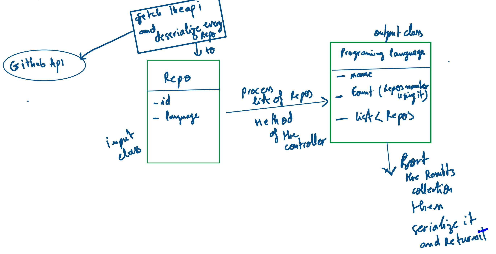

# gemography backend coding challenge
i built this coding challenge using spring framework (J2EE), it consist on fetching the github repositories(created last month) api and returning the languagesused in those repositories with the number of repo and a list of them, foreach programming language.

# 1 fetching the api of github

# 2 processing the Response 

# 3 returning the results sorted (most used programing language -> less used)

